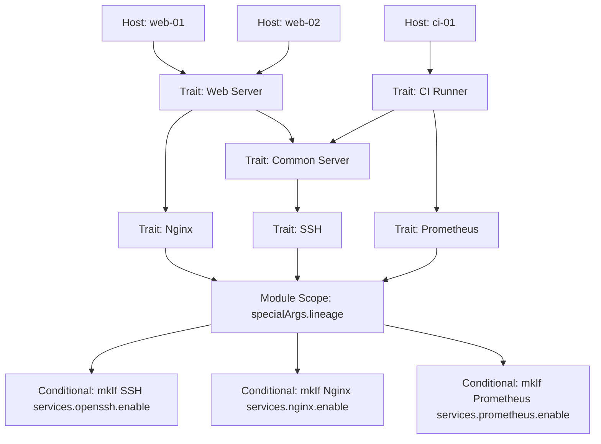

[](https://github.com/Jamesx86-64/nix-lineage/actions/workflows/ci.yml)

[](https://builtwithnix.org)
[](https://opensource.org/licenses/Apache-2.0)

# Nix Lineage

Nix Lineage lets you define traits and roles for hosts once, and automatically
propagates dependencies across your fleet. This reduces repetitive
configuration, avoids scattered hostname checks and provides a queryable system
for traits in NixOS modules.

> I built this to solve some of the maintainability issues I started to face as
> my NixOS fleet grew in size to over a dozen hosts, as well as a way to map my
> mental model of these systems and their interactions into an explicit data
> structure.
>
> **⚠️ Status: v0.9 Pre-Release**\
> Production-tested for medium sized fleets (~20 hosts). Not yet validated at
> enterprise scale.
>
> This project helped me both learn and explore **scalable infrastructure, graph
> traversal, algorithm design, data-driven architecture, functional programming
> and reproducible environments.**

## Table of Contents

- [Nix Lineage](#nix-lineage)
  - [Table of Contents](#table-of-contents)
  - [The Problem](#the-problem)
  - [The Solution](#the-solution-to-some-of-these-problems)
  - [Visual Representation](#visual-representation)
  - [Installation](#installation)
  - [Schema & Core Concepts](#schema--core-concepts)
  - [Example](#example)
  - [Debugging](#debugging)
  - [Safety](#safety)
  - [Trade-Offs](#trade-offs)
  - [Maturity & Limitations](#maturity--limitations)
  - [Should You Use This?](#should-you-use-this)
  - [FAQ](#faq)
  - [Closing Thoughts](#closing-thoughts)

## The Problem

Managing NixOS at scale is tricky. One or two hosts? Easy. Dozens? Things get
messy fast.

- Duplicated logic and per-host quirks creep in.
- It’s hard to know which services run where.
- Updating multiple hosts often means copy-pasting or touching dozens of files.
- Auditing or reasoning about the system becomes time-consuming and error-prone.

Traditional approaches—per-host configs, module imports, or profiles—each solve
part of the problem, but none scale cleanly. Without a central, declarative way
to define host roles and capabilities, scaling NixOS reliably is a real
headache. Below are some of the common paradigms used for managing NixOS
configuration as well as how Lineage can be used alongside them:

### Host-specific imports

```nix
# hosts/web-01/configuration.nix
imports = [ ../../modules/ssh.nix ../../modules/nginx.nix ../../modules/monitoring.nix ];
```

**Pros:** Initially dead simple. Very explicit about what runs where and easy to
understand for newcomers.

**Cons:** Doesn't scale past ~5 hosts. When you have 20 hosts importing from 15
modules, you're manually maintaining 300 import relationships. This has high
mental overhead and is extremely inflexible to any change both in filesystem
structure or which modules are in which files.

### Per-host configuration files

```nix
# hosts/web-01/configuration.nix
services.openssh.enable = true;
services.nginx.enable = true;
services.prometheus.exporters.node.enable = true;
# ...repeat for web-02, web-03...
```

**Pros:** Everything about a host lives in one place. Auditing "what runs on
web-01?" is trivial.

**Cons:** Configuration drift becomes inevitable. Without shared logic there is
no central abstraction for "all web servers need X." Copy-paste workflows are
very tedious and error prone: you can spend half an hour updating 12 files but
forget the one, now web-06 is missing a security update.

### Profile composition

```nix
# profiles/web-server.nix
{ config, lib, pkgs, ... }: {
  services.nginx.enable = true;
  services.openssh.enable = true;
  # ...shared web server config
}
```

**Pros:** This is the logical step up, where you combine the previous two, and
is where most advanced NixOS configurations I've seen stand. Profiles group
related configuration, reduce duplication and have clear semantic meaning.

**Cons:** While more scalable than the prior options, profiles are essentially
just a middle ground between the previous two. At scale you will eventually deal
with the limitations of either or both. You still manually maintain which hosts
import which profiles and will have significant duplicated logic that can suffer
drift between many systems.

### Conditional logic in shared modules

```nix
# modules/monitoring.nix
services.prometheus.exporters.node.enable = builtins.elem config.networking.hostName ["web-01" "web-02" "db-01"];
```

**Pros:** This is the gold standard high quality NixOS. Conditional logic is
very flexible and takes advantage of standard nix and nixpkgs functions (`mkIf`,
`mkMerge`, `elem`, etc.) Logic centralizes service definitions meaning changes
to to all systems can happen in one place.

**Cons:** This requires understanding Nix not just using NixOS, knowing where to
use `mkIf` vs `if` vs `optionals` or understanding `let` blocks is not trivial.
Like per-host configuration files, condition logic suffers from configuration
drift; instead of drift between files, drift emerges between modules. Adding
`web-03` means touching N different module declarations. Every module also needs
some sort of host awareness. Then you have the issue of not having a clean way
to audit "what runs on web-01?" without grepping. Even centralized lists used by
multiple modules can diverge when separate modules use slightly separate lists,
eventually you end up with issues like: web-01 is in ssh.nix but not
monitoring.nix.

### External inventory (Terraform/Ansible variables)

```nix
# Inject role from terraform.tfvars or environment
services.nginx.enable = builtins.getEnv "IS_WEBSERVER" == "1";
```

**Pros:** Familiar to ops teams. These separate inventory from configuration
logic.

**Cons:** This breaks the entire NixOS model, and while I'm sure it happens,
I've never seen this in production. These tools are impure breaking `nix build`,
reproducibility and local testing. You now have two totally different sources of
truth that can desync and you can't use Nix's type system to validate
configuration. You pretty much lose most every reason to use NixOS.

## The Solution (To some of these problems)

### Lineage

```nix
networking.firewall.allowedTCPPorts =
  (lib.optional (lineage.has.usage "SSH") 22) ++
  (lib.optional (lineage.has.usage "Nginx") 80);
```

Lineage helps to address these scaling headaches by providing a single,
declarative inventory of host roles and capabilities which live inside Nix and
are exposed to the NixOS module system. This can be used in conjunction with
profiles and conditional logic to prevent the scattering of host identity across
ad-hoc lists, imports, or conditionals, **hosts declare what they are, and
modules declare what they require.** Traits are resolved once and exposed as
pure predicates (lineage.has.\*) that modules can depend on. No more hardcoding
hostnames, duplicating lists and logic, or unwieldy import chains.

Pros:

- Compliments not replaces current best practices like profiles and conditional
  logic
- Single source of truth for host roles and capabilities
- Works with the NixOS module system (merging, priorities, mkIf, introspection)
- No hostnames in modules, no duplicated lists, no implicit coupling
- It becomes trivial to answer “what runs on web-01?” or “which hosts run
  Prometheus exporters?”
- Scales cleanly as hosts and roles grow independently

Cons:

- Like Conditional logic this still requires advanced nix knowledge to use to
  its fullest extent
- Introduces a new abstraction that must be learned and maintained
- The trait database becomes critical infrastructure
- Requires upfront discipline to model roles and relationships explicitly

## Visual Representation



> Add a new web server or CI runner? Simple as adding a new host; all relevant
> modules automatically configure themselves.

## Installation

Due to the need to run before the nixos modules system, currently lineage only
support is **flake only**. There are ways around this for non-flake systems, but
traditional NixOS module support is not a high priority.

### Try on one host without needing to rewrite your flake

```nix
{
  # Add the flake input
  inputs.lineage.url = "github:Jamesx86-64/nix-lineage";

  outputs =
    { nixpkgs, inputs, ... }:
    let
      lineageLib = inputs.lineage.lib.versions."0.9"; # Pin v0.9 or inputs.lineage.lib for latest
      lineageDB = lineageLib.buildDB ./lineage-db.nix; # Load database
      builtLineage = lineageLib.buildHost lineageDB ./test-laptop.nix; # Build host
    in
    {
      # Keep existing hosts
      nixosConfigurations.prod-web-01 = nixpkgs.lib.nixosSystem {
        # existing config here
      };

      # Test Lineage on a single host
      nixosConfigurations.test-laptop = nixpkgs.lib.nixosSystem {
        specialArgs = {
          inherit (builtLineage) lineage; # Inject resolved traits
        };
        modules = [
          ./configuration.nix
        ];
      };
    };
}
```

> See the below: [Schema & Core Concepts](#schema--core-concepts) for how to
> structure your `lineage-db.nix`, host files and use traits in NixOS modules.

## Schema & Core Concepts

Lineage operates on a simple hierarchical model where child traits automatically
inherit their parents. Here's how it works:

### Database Structure

The database is a Nix attribute set where:

- **Root attributes are categories** (e.g., `cpu`, `usage`, `gpu`)
- **Nested attributes are traits** that form inheritance hierarchies
- **Child traits automatically include parent traits** when resolved

### Basic example

```nix
{
  usage = {
    SSH = {
      "Common Server" = {
        Prometheus."CI Runner" = {};
        Nginx."Web Server" = {};
      };
    };
  };
}
```

When a host declares `usage = "CI Runner"`, it automatically inherits:
`["CI Runner" "Prometheus" "Common Server" "SSH"]`

### Input Validation with `strict`

Wrap categories in `strict` to enforce validation and catch typos at eval-time:

```nix
{
  strict.cpu = {
    Intel = {};
    AMD = {};
  };
}
```

Now if a host declares `cpu = "Intl"` (typo), you get an immediate error instead
of silent misconfiguration.

### Cross-Tree References with `_metadata.implies`

Link traits across different categories using `_metadata.implies`:

```nix
{
  cpu = {
    # Host with cpu="<vendor>" automatically gets gpu=["<vendor>"]
    Intel._metadata.implies.gpu = "Intel";
    AMD._metadata.implies.gpu = "AMD";
  };

  gpu = {
    Intel = { };
    AMD = { };
  };

  usage = {
    # "Print Server" enables both server hierarchy AND standalone "Printing" trait
    Server."Print Server"._metadata.implies.usage = "Printing";
    Printing = { };
  };
}
```

This allows traits to trigger related traits in other categories without
duplicating hierarchy.

### Advanced: Embedding NixOS Modules

For specialized cases, embed module logic directly in the database:

```nix
{
  cpu.Intel._metadata = {
    imports = [{ hardware.cpu.intel.updateMicrocode = true; }];
    # or
    modules = [{ ... }];
  };
}
```

**Exposed via:** `lineage.hostModules`

> **Warning:** This moves from "helper library" into "framework territory." Use
> sparingly or not at all, most use cases are better served by checking traits
> in your modules with `lineage.has`.

### Host Configuration

Host files are simple attribute sets:

```nix
{
  cpu = "Intel";              # Single trait
  usage = ["CI Runner"];      # List of traits
  hostName = "prod-ci-01";    # Pass-through values
}
```

### Resolution rules

1. If a category exists in the database → resolve hierarchy, always return as
   list
1. Both single values and lists are accepted as input
1. Categories not in the database → pass through unchanged

### Output API

After resolution, modules access traits via `lineage`:

```nix
{ lineage, ... }: {
  # Check if trait is present (returns true/false)
  services.openssh.enable = lineage.has.usage "SSH";
  hardware.cpu.intel.updateMicrocode = lineage.has.cpu "Intel";

  # Access all resolved traits
  environment.etc."traits.json".text = builtins.toJSON lineage.traits;
  # Returns: { cpu = ["Intel"]; usage = ["CI Runner" "Prometheus" "Common Server" "SSH"]; hostName = "prod-ci-01"; }
}
```

### functions

- `lineage.traits` → Full attribute set of resolved traits (categories as lists)
- `lineage.has.<category> "<trait>"` → Boolean check for trait presence

## Example

### Example lineage-db.nix

```nix
{
  cpu = {
    AMD = { };
    Intel = { };
  };

  usage = {
    SSH."Common Server" = {
      Prometheus."CI Runner" = { };
      Nginx."Web Server" = { };
    };
  };
}
```

### Example test-laptop.nix

```nix
{
  cpu      = "Intel";
  usage    = "CI Runner";
  hostName = "test-laptop";
}
```

### Example configuration.nix

```nix
{ pkgs, lib, lineage, ... }:

{
  # Hostname
  networking.hostName = lineage.traits.hostName;

  # Core modules using Lineage traits
  services = {
    openssh.enable    = lineage.has.usage "SSH";
    nginx.enable      = lineage.has.usage "Nginx";
    prometheus.enable = lineage.has.usage "Prometheus";
  };

  hardware.cpu = {
    intel.updateMicrocode = lineage.has.cpu "Intel";
    amd.updateMicrocode   = lineage.has.cpu "AMD";
  };
}
```

## Debugging

Nix lineage does not yet have builtin debugging tools. Being built in native nix
and around flakes however, allows the use of standard nix tools for debugging.
Below are some examples:

```bash
# See resolved traits for a host
nix eval .\#nixosConfigurations.<flake-name>._module.args.lineage.traits --json | jq

# Validate before deploying
nix flake check
```

## Safety

### Required safeguards

1. **CI validation (non-negotiable):**

   ```yaml
   # .github/workflows/ci.yml
   - run: nix flake check
   ```

1. **Schema enforcement:**

   ```nix
   { strict = { ... }; }  # Typos in host declarations → immediate errors
   ```

1. **Team discipline:**

- Database changes require senior review
- Test on non-critical hosts first
- Keep traditional config as fallback option

> **Important Note:** The database is a piece of critical infrastructure. One
> typo can break multiple hosts.

## Trade-Offs

| Pros                                   | Cons                                |
| -------------------------------------- | ----------------------------------- |
| Centralized trait definitions          | Database is critical infrastructure |
| Automatic dependency propagation       | Must understand trait hierarchies   |
| Eval-time errors vs silent failures    | Debugging traces through database   |
| Audit trail (`nix eval .#host.traits`) | Learning curve for team             |
| No scattered hostname checks           | One typo can break multiple hosts\* |

**Performance:** Negligible (Even massive databases of 400k nodes resolve in
almost two seconds on my laptop cpu). The bottleneck is correct schema usage,
not compute.

> \* You should always be using CI systems to prevent issues like this anyways,
> no system is immune to human error.

## Maturity & Limitations

**What works (v0.9):**

- Core resolution sound, API stable
- Production use on small fleets (6+ months)
- Performance tested at synthetic scale (100k+ traits)

**What's missing:**

- No battle-testing at 50+ hosts / multi-team orgs
- No CLI tools (checks and graph visualization)
- No migration guide from traditional configs

**Roadmap to 1.0:** CLI validation tools, database build caching, better errors,
large-scale validation, finalize API.

> **Note on testing and benchmarks:** Lineage includes a testing and
> benchmarking suite used during development. While it has validated core
> functionality, it is not yet stable enough to be included in this pre-release
> (v0.9).

## Should You Use This?

| Your Situation                    | Verdict                 |
| --------------------------------- | ----------------------- |
| 10-50 hosts, overlapping roles    | ✅ Ideal use case       |
| **Value centralized control**     | ✅ Ideal use case       |
| Have CI infrastructure            | ✅ Good fit             |
| Willing to be early adopter       | ✅ Good fit             |
| < 10 hosts                        | ❌ Probably overkill    |
| Learning NixOS                    | ❌ Too much abstraction |
| Mission-critical fleet            | ❌ Wait for 1.0         |
| Team can't maintain shared schema | ❌ Wrong tool           |

## FAQ

**Replace modules?** No. Lineage resolves traits *before* modules run.

**Conflicts?** Eval-time errors. Resolve explicitly in database.

**Override traits?** Possible but breaks centralization. Use sparingly.

**Gradual adoption?** Yes. Mix traditional and Lineage configs in same flake.

**Need graph theory?** No. Just understand hierarchical inheritance (if you
understand `imports`, you understand this).

**Database too complex?** Split into files or reconsider if this is the right
tool.

## Closing Thoughts

**Try it:** Start with 3-5 non-critical hosts. Validate in CI. Expand if it
clicks, stick with traditional patterns if it doesn't.

> **Contributing:**
> [Open an issue](https://github.com/Jamesx86-64/nix-lineage/issues) with fleet
> size and use case. CLI tooling and large-scale testing most valuable.\
> **License:** [Apache 2.0](https://opensource.org/licenses/Apache-2.0)\
> **Repository:**
> [github.com/Jamesx86-64/nix-lineage](https://github.com/Jamesx86-64/nix-lineage)
